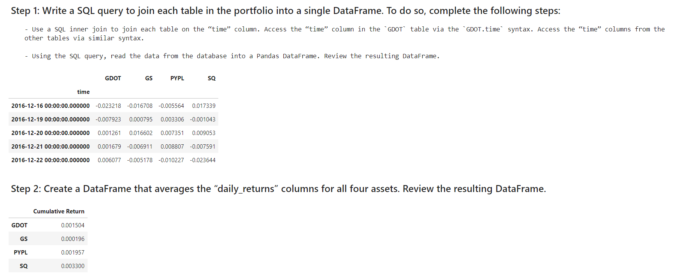

# Module7_Challenge
Module7 Challenge

# Web Application for an ETF Analyze

To analyze the performance to EFT by building web application using SQL, Python and Voila.

## Technologies

Programming Language is Python
Version Control system is Github
Git Bash
Jupyter Lab
sql

Libraries are given below
numpy
pandas
sqlalchemy
warnings
hvplot

## Installation Guide

Install below libraries
pandas
numpy
sqlalchemy
warnings
hvplot

Julpyter Lab needs to be installed through Anaconda.

### Usage

 This project can be used for finding performance to ETF's.
 
 

## Contributors

Kranthi Mitta
Firas Obied
Jennifer Zhang

## License

Copyright (c) 2022 

Permission is hereby granted, free of charge, to any person obtaining a copy
of this software and associated documentation files (the "Software"), to deal
in the Software without restriction, including without limitation the rights
to use  the Software, and to permit persons to whom the Software is
furnished to do so, subject to the following conditions:

The above copyright notice and this permission notice shall be included in all
copies or substantial portions of the Software.

THE SOFTWARE IS PROVIDED "AS IS", WITHOUT WARRANTY OF ANY KIND, EXPRESS OR
IMPLIED, INCLUDING BUT NOT LIMITED TO THE WARRANTIES OF MERCHANTABILITY,
FITNESS FOR A PARTICULAR PURPOSE AND NONINFRINGEMENT. IN NO EVENT SHALL THE
AUTHORS OR COPYRIGHT HOLDERS BE LIABLE FOR ANY CLAIM, DAMAGES OR OTHER
LIABILITY, WHETHER IN AN ACTION OF CONTRACT, TORT OR OTHERWISE, ARISING FROM,
OUT OF OR IN CONNECTION WITH THE SOFTWARE OR THE USE OR OTHER DEALINGS IN THE
SOFTWARE.
